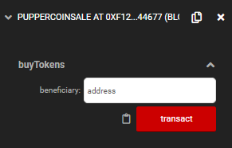
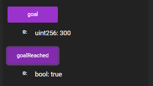
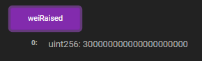
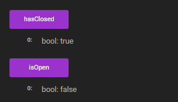
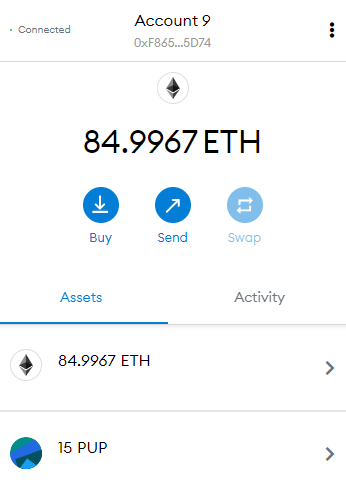
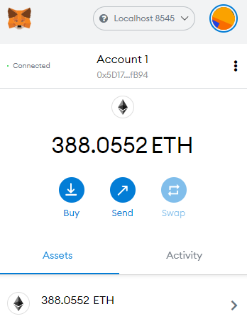

# PupperCoinCrowdsale

## Purchasing PupperCoin
- Enter your address and enter Ether value to purchase Pupper Coin

```1 Ether = 1 Pupper coin```



- Once Goal has reached 




- and salse period is closed 



- finialize the sale


- Now all the beneficiary will receive their Pupper coin



- And the seller would have recieved all the raised Ether


